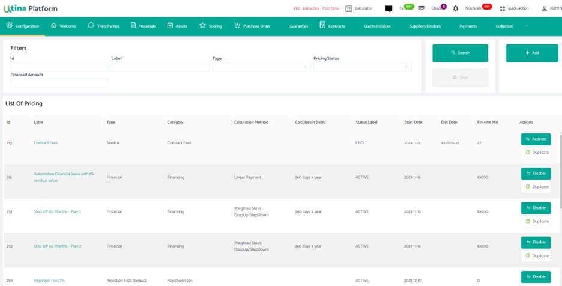
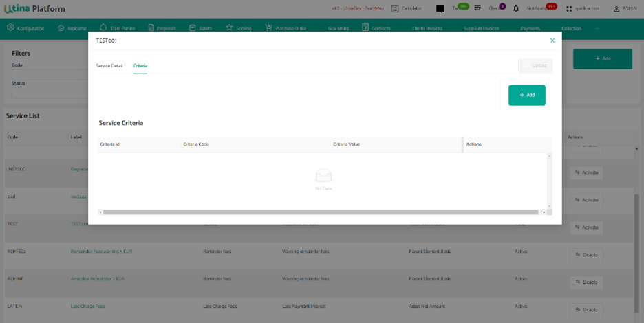

# Pricing Component - Concept & Configuration

# Privacy Policy

The contents of this document are confidential by nature and are to be disclosed only on a need-to-know basis to persons belonging solely to Utina Product.

Any disclosure of the contents of this document to a third party can be done only after a written dialogue with Utina.

Please note that copying, disseminating, or taking any action based on the above information by anyone not intended as the recipient is unlawful.

This document should be considered in its totality for understanding.

# INDEX

{: .no_toc .text-delta }

1. TOC
{:toc}

# I. About this Publication

This document is a setup user guide describing the Utina Pricing component.

The print screens may differ from one user to another. And access rights to procedure, menu, sub-menus, sections, and fields are managed by user profiles access rights.

So, for more information about authorization and access rights management information, please read: Utina\_Management Company concepts.

# II. Audiences

This guide is intended for administrator and auditors responsible for setup the application.

# III. Related Information

For information about Utina products you can visit our official [Website](www.utina.io/)

For information about related product components, see:

- Payment User&#39;s Guide;
- Workflow User&#39;s Guide;
- Proposal User&#39;s Guide;
- Contract User&#39;s Guide.

# IV. Special Conventions

Conventions used in this guide:

| **Convention** | **Meaning** |
| --- | --- |
| **Bold** | The object of an action: menu names, field names, options, button names - Commands typed at a prompt - User input |
| _Italic_ | Names of books, chapters and sections as references - Emphasis |
| Monospace | Directories and subdirectories - File names and extensions - Process names - Code sample, including keywords and variables within the text and as separate paragraphs, and user-defined program elements within the text |
| \&lt;Variable\&gt; | Substitute input value |

# V. Summary of Changes:

This publication contains additions and changes to information previously presented in Pricing Setup.

|                         |  |
| ----------------------- | -|
| **General Changes**     |  |  
| **New Information**     |  |  
| **Changed information** |  | 
| **Deleted information** | 

# VI. High Level Concept

## 1. Document Overview:

About: The purpose of this document is to describe the Utina Platform approach regarding handling pricing concepts. It also serves as a guide to help manage the different features and proceed to the configuration using detailed setting books and screens.

Utina Pricing is a powerful tool,
easy to set up and maintain

## 2. Pricing Overview:

The pricing is the value establishment of all criteria allowing a predefined model for payment calculation.

In general, when a user leases an asset, the user&#39;s monthly payment will be calculated based on the several factors:

- How much the user has to pay at the start of the lease, which is the upfront;
- The lease&#39;s term or duration in Months or Years;
- The expected asset value at the end of the lease;
- The fees that he will have to pay at the end of the lease, which is the Residual Value;
- The &quot;money factor&quot; or rent charge, which is similar to an interest rate on an asset loan;
- Possible termination fees if the user wants to return the asset before the lease ends;
- Etc.…

Once we define the asset amount, down payment, residual value, duration, and interest rate in the pricing, we will get the payment price.

In Utina Platform, we define the pricing as the lease/rental agreement covering different concepts that will be described in this document:

- Offer
- Pricing Element
- Pricing Filtering
- Pricing Pack
- Commission
- Service
- Marketing Campaign

## 3. MCD Conceptual Data Model:

From simple to highly complex,

Utina handles any Pricing Model!

 

# VII. Detailed Concepts

The essential features of the Pricing module of Utina are discussed in depth in this chapter.

## 1. Pricing Element:

A Pricing element is an object that uses to capture different types of prices, costs, adjustments, taxes, or profit margins.

The Pricing component is based on two essential elements:

- Contract Element
- Pricing Formula

### 1.1. Search:

1. Log in to the application by typing the system user name and password.

2. Click OK to start the application.

On the Utina home page, the user can access the Pricing component through the Configuration menu > Pricing > Pricing element:

The Pricing element menu will be displayed:

This section describes how to perform a filtering search for USERS using more extensive criteria. The user can sort the list using specific fields.

The user can select one or more specific filters to do a search or click on the button &#39;Search&#39; directly:

- ID
- Label
- Type (Type of Pricing)
- Pricing Status
- Financed Amount

And then click &#39;Search&#39; :

The screen will display like below:

### 1.2. Configuration:

#### 1.2.1 For Contract Element:

##### 1.2.1.1 Contract Element Creation: Type Financial

To create a new financial Pricing element, the user should click the &#39;Add&#39; button.

The following screen will be displayed:

###### General Data:

The General Data section is composed by:

- **Label:** The Label of Pricing
- **Start Date:** The start date of the Pricing
- **End date:** the end date of Pricing
- **Type:** The type of pricing (Financial, Service, or other)
- **Category:** The category is related to the kind of Pricing
- **Pricing Description:** to describe the Pricing
- **Fin Amount Min:** The minimum Financing Amount
- **Fin Amount Max:** The maximum Financing Amount
- **Billing Date:** The Billing date
- **Tax code:**
  - Without Tax: No tax will be calculated
  - Standard rate: the tax will be calculated with the standard rate
- **Flag Grace Period**
- **Flag Fin Service**
- **Flag Mandatory**
- **Flag Update**

The user should select the type Financial:

###### Calculation Mode:

The Pricing component allow us to choose the calculation type modes.

**Linear Payment:** Linear Payment means a term loan with a fixed amortization schedule providing for the repayment of fixed, equal amounts of principal at regular intervals until maturity.

7. Calculation method with STEPS:

- **Multiple Steps:** Multiple Steps is a method of payment that allows using multiple payments.
- **Weighted Steps:** The first step of the calculation is to take each of these payments and multiply them by the number of years until the payment occurs.
- **Seasonal Payment:** A seasonal payment (seasonal loan) is a loan that is repaid in keeping with a company&#39;s seasonal [cash flow](https://www.bdc.ca/en/articles-tools/entrepreneur-toolkit/templates-business-guides/glossary/cash-flow).

Referring to business requirements, the user can create one or multiple steps via the screen STEPS)

The Steps screen is composed by :

- Order of steps
- Duration of steps
- Periodicity
- Rental Coefficient percentage: use if based on rental
- Coefficient Outstanding: use if based on outstanding

The user should fill in the information of the steps and click &#39;Save&#39; : (except Coefficient)

To update, On action, click &#39;Delete&#39; and read a new step.

10. Return to the Pricing detail and complete the Rate section:

###### Rate:

The Rate section is composed by:

- **Type of Rate:**

**The Type of Rate:**

- **Nominal rate** is a rate of interest used in adding compound interest to a principal sum when interest is compounded other than annually.
- **Effective rate** is an [actual](https://dictionary.cambridge.org/dictionary/english/actual) [rate](https://dictionary.cambridge.org/dictionary/english/rate) after everything has been [considered](https://dictionary.cambridge.org/dictionary/english/considered), [rather](https://dictionary.cambridge.org/dictionary/english/rather) than a [rate](https://dictionary.cambridge.org/dictionary/english/rate) that is [planned](https://dictionary.cambridge.org/dictionary/english/planned), [offered](https://dictionary.cambridge.org/dictionary/english/offer), etc.
- **Discounted at the end of the period**.
- **Discounted at begin of the period**.
- **A Floating rate** is a [rate](https://dictionary.cambridge.org/us/dictionary/english/rate) that can [change](https://dictionary.cambridge.org/us/dictionary/english/change) over a [period](https://dictionary.cambridge.org/us/dictionary/english/period) of [time](https://dictionary.cambridge.org/us/dictionary/english/time).

- **Calculated formula:**
The type of rate will determinate the calculated formula of the selected rate:

**EG:** The nominal rate type will determine the formula Market Money Rate .

- **Periodicity**:
- also the user can fill the periodicity of the rate:

- **Value default** : is the rate value default.

- **The spread:** 

The use of Pricing in the Proposal modification of the default Pricing settings will trigger a functional control and be monitored by the request type, the request receiver, and the profile.

###### Duration:

The Duration section is composed by:

- Duration Default
- Duration Min
- Duration Max
- Periodicity
- Term
- Unit

Again, the use of Pricing in the Proposal modification of the default Pricing settings will trigger a functional control and be monitored by the request type, the request receiver, and the profile.

###### Grace Period:

Grace period refers to the time frame between the date when the user billing cycle and the date when user payment is due; there is a method of calculation that Utina offers:

The Grace Period section is composed by:

- **Grace Period Method:**

- **Capitalization:** the interest will be capitalized when repayment begins.
- **Interest Invoicing:** The interest will accrue at the beginning of the payment.
- **None:** No grace period
- **Grace period Duration:** It&#39;s the duration of the grace period in months.

###### First Rental:

The First Rental section is composed by:

- % Amount Min: The percentage of the Minimum Amount
- % Amount Max: The percentage of the Maximum Amount
- Default Value: The Default Value of the Amount

Once more, the use of Pricing in the Proposal modification of the default Pricing settings will trigger a functional control and be monitored by the request type, the request receiver, and the profile.

###### Residual Value:

[The Residual Value is the estimated value of a fixed asset at the end of its lease term or useful life.](https://www.investopedia.com/terms/r/residual-value.asp)

The Residual Value section is composed by :

- RV Min %: The Minimum Residual Value in percentage

- RV Max % : The Maximum Residual Value in percentage
- RV Default %: The Default Residual Value in percentage
- RV Default Value: The Default Residual Value in amount

And again, the use of Pricing in the Proposal modification of the default Pricing settings will trigger a functional control and be monitored by the request type, the request receiver, and the profile.

###### Deferred interest:

A Deferred Interest allows the deferral of some or all of a loan&#39;s interest, enabling borrowers to make smaller payments for a specified time.

The Deferred Interest section is composed by:

- **Deferred Interest Method:**
- **Interest invoicing at the beginning of the contract:** The interest will be capitalized at the beginning of the contract.
- **Capitalization of Interest:** The interest will be generated between the start date and the first billing date.
- **Part of Rental**
- **None:** No deferred interest.
- **Nominal Rate**

###### Deposit:

The Deposit section is composed by:

- **Deposit Amount:** The collateral Amount.
- **% Amount:** The percentage of the Deposit Amount according to the mortgage.
- **Interest Method:**
- **Reducing Interest of Installment:** the interest generated by the deposit amount will be reduced from the due.
- **None:** No interest Method.
- **Nominal Rate:** the Nominal Rate of the deposit amount; this field will display when choosing interest method.

###### Participation:

Participation means an interest in a loan that is acquired indirectly by way of participation from a selling institution.

The Participation section is composed by:

- **Calculation Method:**
  - Supplier Credit:
  - Reduce Financing Amount:
  - Prom (Reduce Fin Amount):
  - None:

- **Participation Amount**
- **Participation Rate**
- **Number of Days**
- **Third-party Role**
- **Third-party**

And select the third-party Role and the third party (created in the Third Party section):

Click on the &#39;Search&#39; button on the Third Party:

All third party with the selected role will display:

Then click &#39;OK&#39;.

The user can see all information about the third party on Open Synthesis or in the Financial element screen:

Click on &#39;Third Party&#39;, and the screen will display all information of the third party:

Seamless integration with any
Third-Party or Retail solutions

###### Prefinancing:

The Prefinancing section is composed by:

- **Calculation Method**
- **Nominal Rate**
- **Basis**
- **Periodicity**
- **Rate Type**
- **Rate formula**

###### Upfront:

The Upfront section is composed by:

- **Amount Min**
- **Amount Max**
- **Default Value**

The use of Pricing in the Proposal modification of the default Pricing settings will again trigger a functional control and be monitored by the request type, the request receiver, and the profile.

Click on the &#39;Save&#39; button. A Pricing Id will be generated. :

##### 1.2.1.2. Contract Element Creation Type No Financial:

Log in to the application by typing the user system user name and password.

Click &#39;OK&#39; to start the application.

On the Utina homepage, the user can access to Pricing component through the Configuration menu > Pricing > Pricing element:

The Contract element types No Financial is composed by:

- **Service:** Service Lease or Rent is a type of lease where the lessor undertakes the responsibility to serve all the assets that the lessee leases out.
- **Commission:** Commission means a fee payable to a broker or other third party in connection with a lease or the expansion or renewal of a lease.
- **Financed Service:** The Financed Service is an agreement where the lessor receives lease payments to cover its ownership&#39; costs. The lessee is responsible for maintenance, insurance, and taxes. Some finance leases are conditional sales or hire purchase agreements.
- **Contract Fees:** [Contract Fee](https://www.lawinsider.com/dictionary/lease-fee) means any monetary fee or other charge or consideration, or any combination thereof, charged by or paid during a particular shift, or for any period.

4.Click the &#39;Add&#39; button.

The screen will display the following information:

###### General Data:

In General Data, the type is composed of no financial element:

- Service
- Commission
- Contract Fees
- Financed Service

When choosing **Service:** the category will display all services created on the Service menu (the user will find an explanation on the Service section [below](#_Add_a_new)).

When choosing **Commission:** the category will display all commissions created on the Commission menu (the user will find an explanation [below](#_Add_a_new_1)).

When choosing **Financed Service:** the category will display all financed services (the user will find an explanation on the Service section [below](#_Add_a_new)).

When choosing **Contract Fees:** the category will display all contract fees (the user will find an explanation on the Service section [below](#_Add_a_new)).

###### Request Type:

The use of Pricing in the Proposal modification of the default Pricing settings will trigger a functional control and be monitored by the request type, the request receiver, and the profile.

Click &#39;Save&#39; and a Pricing ID will be generated.

#### 1.2.2. For Pricing formula:

##### 1.2.2.1 Create a Pricing Formula:

1. Log in to the application by typing the system user name and password.

2. Click &#39;OK&#39; to start the application.

3. On the Utina homepage, the user can access to Pricing component through the Configuration menu > Pricing > Pricing element:

The Pricing element menu will display:

4. Click the &#39;Add&#39; button.:

5. Choose a Formula in Type. Fill in all the Financial Pricing sections that will be displayed:

###### General Data:

In General Data, the type is composed a formula:

- Modification Fee Formula:
- Total Pay off Fees Formula:
- Partial Pay off Fees Formula:
- Degradation Fee Formula:
- Rejection Fee Formula:
- Reminder Fee Formula:
- Late Charge Formula: For late charge calculation.

Fill in all information and go to the section Request Type:

###### Request Type:

Click &#39;Save&#39; and a Pricing ID will be generated:

### 1.3. Update a Pricing element:

#### 1.3.1 Update:

1. On the Utina homepage, go to Configuration  Pricing  Pricing element and click on it. 

2. Click on the &#39;Search&#39; button, and the list of Pricing element will display:

3. Click on one existing pricing:

4. The pricing information will display:

5. The user can modify information and click &#39;Update&#39;:

The user can add Criteria on the Pricing element, through Pricing > Pricing Criteria > Add:

9. After clicking on the &#39;Save&#39; button, an ID will be generated, and the Pricing criteria will be added as below:

10. The user can also delete the Pricing criteria by clicking on the &#39;Delete&#39; button.

11.To add Pricing commission, click on the created Pricing > Pricing Commission > Add 

A screen of Pricing commission detail will display:

After the user complete the following information, an ID will be generated :

When choosing the Calculation method _Multiple Steps, Weighted Steps or Seasonal_ on Financial Type_,_ a new screen will display:

The user can update or delete steps:

#### 1.3.2 Actions:

8. To activate the Pricing, go to Action and click &#39;Activate&#39; (the user can also disable or terminate the Pricing element):

9. To duplicate the Pricing element, go to action and click &#39;duplicate&#39;: 

## 2. Pricing Filtering

## Service:

A service is a help given to a client in exchange for money. Therefore, it is also intangible and can only be qualified and described, not weighted and carried like a product. All companies offering services are part of the tertiary sector.

For example, a service Lease is a type of lease where the lessor undertakes the responsibility to serve all the assets that the lessee leases out.

### Search:

1. Log in to the application by typing the system user name and password.

2. Click &#39;OK&#39; to start the application.

On the Utina homepage, the user can access to the Pricing component through the Configuration menu > Pricing > Service:

The Service menu will be displayed:

This section describes how to perform a filtering search for USERS using more extensive criteria. The user can sort the list using specific fields.

The user can select one or more specific filters to make a search or click on the &#39;Search&#39; button directly:

- Code
- Label
- Service Type
- Category
- Status

And then click &#39;Search&#39;.:

The screen will display like below:

### Configuration:

The Service component starts with the service creation by adding the following main data:

- Service General Data
- Service
- Invoicing
- Supplier

#### Create a New Service:

1. On the Utina homepage, go to Configuration  Pricing  Service and click on it. 

2. To add a new service, click the &#39;Add&#39; button

3. A New Service screen will be displayed:

The New Service screen is composed by:

- General Data
- Service: Information related to service
- Invoicing: Information related to invoicing
- Supplier: Information related to supplier

##### General Data:

The General Data section is composed by :

- Code
- Label
- Currency
- Start date
- End date

After completing the general data information, fill the information in the Service section:

##### Service:

The Service section is composed by :

- **Service Type:**
- **Category**
- **Service Basis**
- **Amount Basis**
- **Service Duration:** The field Service Duration is related to other fields like below :

| ServiceDuration | Flat once at effect date | Following Payments Schedule | Free Duration | Following Contract Duration, Free periodicity | Steps, Following Payment Schedule | Steps, Free Duration and periodicity | Flat, but spread over the contract duration | Flat, once with first rental |
| --- | --- | --- | --- | --- | --- | --- | --- | --- |
| Service periodicity | Hide | Hide | Display &amp; Mandatory | Display &amp; Mandatory | Hide | Display | Display &amp; Mandatory | Hide |
| Servicedurationdefault | Hide | Hide | Display &amp; Mandatory | Hide | Hide | Display | Hide | Hide |

- **Service Calculation Method:** The field Service Calculation Method is related to other fields like below:

| ServiceCalculation Method | Fixed amount | Percentage of basis | Fixed amount + Percentage of basis | (Fixed amount + Percentage of basis)\*(1+margin) |
| --- | --- | --- | --- | --- |
| Fixed Amount | Display &amp; Mandatory | Hide | Display &amp; Mandatory | Display &amp; Mandatory |
| Percentage | Hide | Display &amp; Mandatory | Display &amp; Mandatory | Display &amp; Mandatory |
| Margin on calculation | Hide | Hide | Hide | Display &amp; Mandatory |
| Additional calculation | Hide | Hide | Hide | Display &amp; Mandatory |

- **Service Period**
- **Service Duration Definition**
- **Fixed Amount**
- **Percentage**

##### Invoicing:

The Invoicing section is composed by:

- Type:

- Line: 

- Category: 

- Tax Code: 

##### Supplier:

The Invoicing section is composed by :

- Third party Role
- Third party
- Service Repayment Mode :
  - On invoice
  - On receiving payment
  - None  
  
- Flag Auto Expense
- Service Repayement Percentage
- Service Repayment Fixed Amount

Click  save :

A new service will be created.

### Update Service:

##### 3.2.2.1 Update:

1. On the Utina homepage, go to Configuration > Pricing > Service and click on it. 

2. Click on the &#39;Search&#39; button, and the list of services will be displayed. 

Click on &#39;Service&#39; to modify. 

The selected service will display and the user can modify information and click &#39;Update&#39;. 

6. The user can add criteria on the Service 

Select a Criteria Code and a Criteria Value and click &#39;Save&#39;. 

After Saving, a Service Criteria ID will be generated:

To delete a Service Criteria, click on the &#39;Delete&#39; button on Service Criteria 

##### 3.2.2.2 Action:

The user can activate, disable or terminate a service. 

## Commission:

A commission is a percentage or fixed payment associated with a Pricing.

### Search:

### Configuration:

#### Add a New Commission:

1. On the Utina homepage, go to Configuration  Pricing  Commission and click on it. 

2. To add a new commission, click the &#39;Add&#39; button. 

3. A new commission screen will be displayed:

4. After completing the following information, click on the &#39;Save&#39; button 

5. A new commission will be added; click &#39;Search&#39; on the list and click on the new commission 

6. The user can add criteria on the Commission 

Select a Criteria Code and a Criteria Value and click &#39;Save&#39;:

A Commission Criteria Id will be generated:

The user can delete a Commission Criteria by clicking on &#39;Delete&#39;:

### Update Commission:

On the Utina homepage, go to Configuration  Pricing  Commission and click on it. 

Click on the &#39;Search&#39; button, and the list of services will be displayed 

Click on one existent commission 

The screen will display:

Modify desired information and click &#39;Update&#39; 

The user can also modify criteria on the Commission:

The user can add a new criteria:

The user can delete a criteria:

## Pricing pack:

A Pricing Pack encompasses all the pricing elements created above, namely Financial, Service and Commission.

The whole pack will be associated with a predefined offer, and the offer will inherit the entire pack data. So, the offer&#39;s entered data will be overwritten by those of the pack.

### Search:

### Configuration:

The Pricing Pack component starts with the commission creation, by adding the following main data:

Offer Detail

Parameter Filtering

Parameter Value

Criteria

Pricing

#### 4.3.2 Add a new Pricing Pack:

1. On the Utina homepage, go to Configuration  Pricing  Pricing pack and click on it 

2. To add a new Pricing Pack, click the &#39;Add&#39; button 

3. A new Pricing Pack screen will be displayed:

4. After completing the following information, click on the &#39;Save&#39; button 

An ID will be generated for the new pack; click on &#39;Search&#39; and click on the new created pack 

The screen will display, and the user can add criteria on the Pricing Pack by clicking on the &#39;Add&#39; button 

Select a Criteria Code and a Criteria Value and click &#39;Save&#39;; and an ID for that criteria will be generated 

### Update Pricing Pack:

## Offer:

An Offer is nothing more than a specific product that a user offers to its customers for a particular Pricing over a specified period. And it can be attached to a marketing campaign.

The Offer Menu provides the ability to:

- Configure one or more offers;

- Manage Offers;

- View each offer specific details related to this application.

**Note:** All offers can be active at a time.

### Search:

### Configuration:

The Offer component starts with the offer creation by adding the following main data:

- Offer General Data
- Calculation Method
- Rate Information
- Duration
- First Rental Information
- Residual Value Information
- Deferred Interest and Prefinancing Method Information
- Upfront Data

#### Add a New Offer:

**This section describes how to initialize and perform simple tasks using the Offer Menu:**

It is therefore dedicated to the offer configuration throughout the screening.

**To start the Offer:**

1. Access the following URL using a web browser:

[https://dev.utina.io/](https://dev.utina.io/)

Where:

- Hostname: the host or the IP address of the server containing the Utina applications;

- Port: the TCP port number, listening to HTTP requests.

**Note:** The user needs to contact the system administrator for the values that apply to the user organization.

2. Log in to the application by typing the system user name and password.

3. Click OK to start the application.

4. In the Utina homepage, go to Configuration > Pricing > Offer and click on it.

The Offer menu will be displayed.

### Update an Offer:

## Marketing campaign:

Utina Pricing can be all-inclusive or modular
according to your business needs

<h1>Got a question? <a href='mailto:hello@utina.com'>Get in touch</a></h1>

Utina team of experienced professionals provides all the help and information you need to keep our product working for you.

 
<a href='utina.io'> www.utina.io </a>

