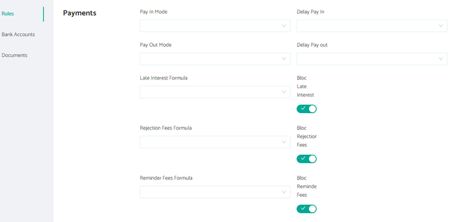
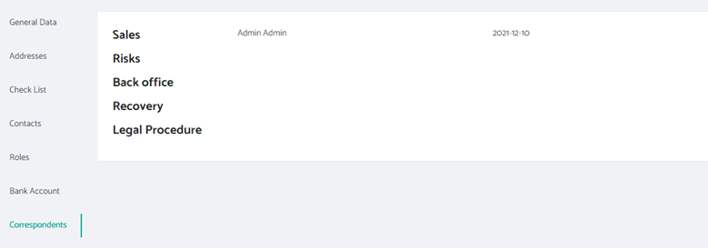
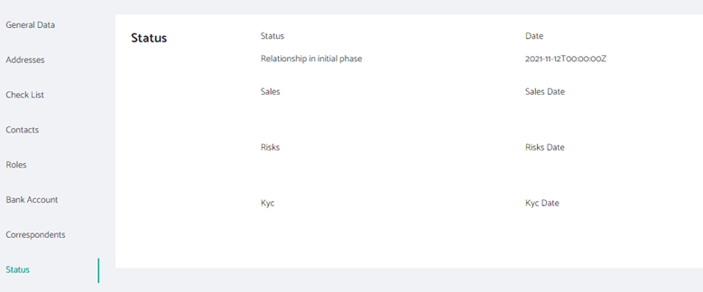
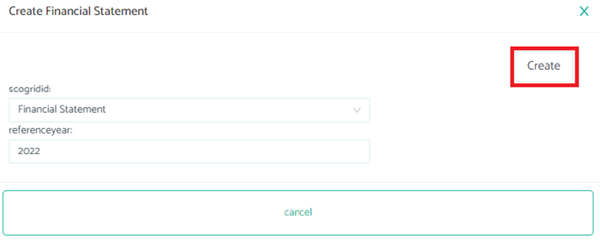
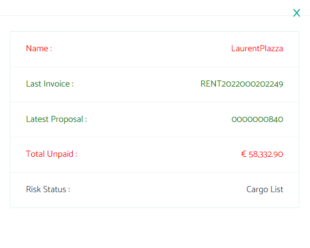

# Third Parties Component - User Guide

# Privacy Policy
The contents of this document are confidential by nature and are to be disclosed only on a need-to-know basis to persons belonging solely to Utina Product.
Any disclosure of the contents of this document to a third party can be done only after a written dialogue with Utina.
Please note that copying, disseminating, or taking any action based on the above information by anyone not intended as the recipient is unlawful.
This document should be considered in its totality for understanding.

# Index
{: .no_toc .text-delta }

1. TOC
{:toc}

# I. Preface

# 1. Introduction

Third Parties component user guide intended to give assistance to end-users on how to use Third Parties component safely and effectively. It describes the process of creating and modifying the Third Parties component in Utina Platform.

The print screens may differ from one user to another. And access rights to procedure, menu, sub-menus, sections and fields are managed by user profiles access rights.

So, for more information about authorization and access rights management, please read: [Management Company Documentation](../../assets/docs/) concepts and setup.

## 2. Audiences

This manual is intended for the following Users:

| **Role**            |  **Function**               |
| --------------------| ----------------------------|
| Sales Representative|  Create, Update, and consult|
| Sales Manager       |  Create, Update, and consult|
| Back Officer        |  Update, and consult        |
| Back-Office Manager |  Update, and consult        |
| Analyst             |  Consult                    |
| Risk Manager        |  Create,and Update          |

 Sales Manager
 Back Officer Back-Office Manager
 Analyst
 Risk Manager | Create, update, and consult Create, update, and consult Update and consult Update and consult Consult Consult and update |

## 3. Related Information

For information about Utina products, see: Utina Company [Website](http://www.utina.io/)

For information about related Assets component documentation and use, make sure to read:

- [Assets User&#39;s guide](../../assets/)
- [Supplier Invoice/Client Invoice/Payment User&#39;s Guide](../../assets/)
- [Proposal&#39;s Guide](../../assets/)
- [Contract User&#39;s Guide](../../assets/)

## 4. Version History

| **Version** | **Date** | **Author(s)** | **Description** |
| --- | --- | --- | --- |
| 1.0 | 2022-01-26 | Utina | Creation |

## 5. Acronym Glossary:

Below is a list including the definitions of the acronyms used in the document.

| **ACRONYM** | **DEFINITION** |
| --- | --- |
| Third Party | Individuals or companies that intervene during the contract life cycle |
| Proposal | The Commercial Offer, including all the financial elements, the financed asset, third parties such as client, supplier management company, or others |
| Contract | Realization of the proposal approved by the client and validated by the management company |
| Status | Define the status of the relationship: initial, active, terminated |
| Role | Could be client, supplier, guarantor, or other |
| Flows | Transactions carried out by a third party |
| Income | Revenue that third party earns |
| Type | Third party type: natural person or legal person |
| Legal Form | Classification of companies |
| Communications | Interactions between third party and the management company |
| Risk Level | The criteria ensuring that the management company does not do business with that third party in case of a high-risk level |
| Check List | List of things to be checked |
| KYC | Know Your Customer |
| Synthesis | Quick information on third party |

## 6. Connection instruction:

1. Lunch the application via the URL:
2. Identify via Login screen
3. Access to Utina Platform

Once connected, the system shows to the user:

- The Main Menu
- The received checks: Requests for validation to follow the process
- Notifications: For Information
- The On-Going Tasks: List of tasks requested by other users to be executed, in order to follow the process

Select the`Third Parties`menu.

# II. Third Parties Search

Retrieve all kinds of data related to Third Parties and Stakeholders in the financing operations

This screen allows to perform simple or complex search.

Search can be launched via:

- Third Party Reference

- Third Party Name

- Third Party Fiscal ID

1. First, specify criteria by combining different filters

2. Then, click on the`Search`button

It is possible to search for a Third Party by entering only a part of its name.

Once the Third Party is found, please click on the Reference hyperlink to visualize the Third Party details.

# III. Third Parties Creation

To create a new Third Party:

1. Click on the`Add`button.

The input screen appears with several sections.

## 1.General Data

General data section includes general information about the Third Party.

This Data can be:

- Dropdown list (Type, Legal form, Activity, or other)
- Loop icon  launching a search screen: Parent Company
- Free input fields

Enter:

- Third Party type can be:
- Individual: Physical person
- Company: Corporate entity

Depending on the type of actor, the fields displayed in the &#39;General Data&#39; section are different.

In case of Individual Type:

| **Fields** | **Description** | **Status** |
| --- | --- | --- |
| Reference | System-generated reference that is unique to the Third Party ||
| Type | List of values: Individual, Company | Mandatory |
| Name | Third Party&#39;s name | Mandatory |
| Surname | Third Party&#39;s surname ||
| Salutation Code | List of values: MR, MRS,MS ||
| Gender | Radio button: Male/Female ||
| Birth date | Third Party&#39;s date of Birth | Mandatory |
| Birth Country | List of values: countries&#39; list ||
| Profession | List of values: Doctor/Teacher, etc. ||
| Working Contract Type | List of values: Permanent/Fixed Term ||
| Working Contract Date | Date of contract beginning ||
| Identity Card Type | List of values: Passport /Id Card | Mandatory |
| Identity Card ID | Third Party&#39;s ID number ||
| Fiscal ID | Third Party&#39;s Fiscal ID number ||
| Fiscal City | Third Party&#39;s Fiscal City ||
| Tax ID | Third Party&#39;s tax ID ||
| Marital Status | List of values: Single/Married | Mandatory: if the chosen option is Married, spouse section fields are mandatory |
| Nb of children | Third Party&#39;s number of children ||
| Origin | List of values of lead sources: website/marketing email, or other ||
| Special Tag | List of values of Third Party&#39;s classification ||
| Broker | List of values of Brokers ||
| Branch | List Of values of Branches ||
| Consent | Consent or agreement required from the Third Party ||
_Table 1: Individual General Information_

In case of Company Type:

| **Fields** | **Description** | **Status** |
| --- | --- | --- |
| Reference | System-generated reference that is unique to the Third Party ||
| Type | List of values: Individual, Company | Mandatory |
| Name | Company&#39;s name | Mandatory |
| Marketing Name | Marketing company&#39;s name | |
| Activity | List of values set up | Mandatory |
| Legal Form | List of values set up | Mandatory |
| Creation Date | Date of company creation | Mandatory |
| Manager Name | Name of the company representative | |
| Manager Position | List of values: President/shareholder, or other | |
| Fiscal ID | Company&#39;s Fiscal ID number | |
| Fiscal City | Company&#39;s Fiscal City | |
| Tax ID | Company&#39;s tax ID | |
| Capital | Company&#39;s capital | |
| Parent Company | Third Party having control on the company | |
| Capital holding | Percentage of capital holding by the Parent Company | |
| Origin | List of values of lead sources: website/marketing email, or other | |
| Special Tag | List of values of Third Party&#39;s classification | |
| Broker | List of values of Brokers | |
| Branch | List of values of Branches | |
| Consent | Consent or agreement required from the Third Party | |
  _Table 2  : Company General Information_

Fields preceded by (\*) are mandatory, such as:

## 2.Addresses (To be modified)

In Utina Platform, a Third Party can have one or more addresses, although at least one address has to be informed.

To add a new address, please click on the`Address`section, and then enter the following information:

- Address 1
- Address 2
- Zip Code
- Region

## 3.Contacts

In this section, the user specifies the different contacts linked to the Third Party by clicking on the`Contacts`section.

To add a new contact:

Please click on the &#39;Contacts&#39; section, and then enter the following information:

- Phone
- Mobile
- Mail
- Contact Name
- Contact Position

## 4.Roles &amp; Payments (To be modified)

- Roles

A Third Party in Utina can have one or more active roles at the same time. It can, for example, be a client of one file and a supplier or guarantor of another.

It is mandatory to indicate at least one role.

To select a role, please press one or more options from the radio buttons or choose one of the available ones from the list of values.

- Payments

This section is dedicated to the payment method of the Third Party, allowing to assign to a Third Party the means of payment as also the payment delays and the formulas for calculating the additional costs.

To define the Third Party&#39;s means of payment, the user should enter the following fields&#39; information:

  | **Fields** | **Description** | **Status** |
| --- | --- | --- |
| Pay In Mode | List of values of the Means of Payment: Bank Transfer, Cash, Check, or other | Mandatory |
| Pay Out Mode | List of values of the Means of Payment: Bank Transfer, Cash, Check, or other | Mandatory |
| Delay Pay In | List of values of the Delay of Payment: Immediate or &quot;N&quot; Days after due date | Mandatory |
| Delay Pay Out | List of values of the Delay of Payment: Immediate or &quot;N&quot; Days after due date | Mandatory |
| Late Interest Formula | List of values of the Late Charge Fees |
 |
| Rejection Fees Formula | List of values of the Rejection Fees Formula: 1% |
 |
| Reminder Fees Formula | List of values of the Reminder Fees Formula: Warning Reminder, etc. |
 |
| Bloc Late Interest | Radio button: If ticked late, the interest invoicing is blocked for that Third Party |
 |
| Bloc Rejection Fees | Radio button: If ticked, Rejection Fees invoicing is blocked for that Third Party |
 |
| Bloc Reminder Fees | Radio button: If ticked, Reminder Fees invoicing is blocked for that Third Party |
 |

_Table 3 : Third Party&#39;s Payment_

## 5.Bank Accounts (to be modified)

In this section, the user must fill in the bank accounts linked to the Third Party concerned.

As in Utina&#39;s platform, an actor must have one active bank account.

So, to add a new bank account, the user has to fill out:

- Bank Account Type
- IBAN
- BIC
- Bank Name
- CB date
- CB Name
- CB key

## 6.Documents (need adjustment)

In Utina&#39;s platform, it is possible to attach documents in electronic format to a Third Party, on the`Documents`section.

By simply clicking on this section, the screen displays the list of all the attachments that are accessible to users.

These are the actions they can perform here:

- Upload a document by using the`upload`button
- Check and visualize document details by clicking on the`download`llink
- Validate or refuse it by clicking on the`action`button

## 7.Correspondents (Screen to be modified)

Utina Platform stores users who have intervened on the Third Party in the &#39;Correspondents&#39; section. For example, a user who created the Third Party or those who passed events or changed the status of the Third Party.

## 8.Status (screen to be modified)

This section is dedicated to the rating of the Third Party, allowing to display the status of the Third Party in terms of risk, KYC, Sales, and overall.

To assign a status manually to the Third Party, the authorized user can execute the action`Update Status`(for more details, please check the`Update Status`paragraph).

## 9.Income (For Individual)

This section is dedicated to entering information related to the Third Party employment, Income, and Expenses.

To fill in this information the user should enter all fields:

- Employer
- Employer Tel: Free input field
- Employer Address: Free input field
- Monthly Income: Free input field
- Other Income: Free input field
- Family Benefits: Free input field
- Other Loan: Free input field
- Other expenses: Free input field

## 10.Financial Statements (For Company)

In this section, the user can insert the Third Party&#39;s financial statement data according to the input template already set up.

To insert a financial statement the user has to:

1. Press the &#39;create&#39; button
2. Select a financial statement
3. Mention the reference year
4. Press &#39;create&#39; button

## 11.Spouse

For Third Parties having a type &quot;Individual&quot; and a Marital Status = Married, the fields of this section are mandatory.

In this section, the user has to enter the information related to the Third Party&#39;s spouse by filling in the following fields:

  | **Fields** | **Descripton** | **Status** |
| --- | --- | --- |
| Salutation Code |
 |
 |
| Name | List of values: Mr/MS |
 |
| Surname | Free input |
 |
| Maiden Name |
 |
 |
| Birth City |
 |
 |
| Birth Country | List of values: countries |
 |
| Gender |
 |
 |
| Birth Date |
 |
 |
| Identity Type |
 |
 |
| Identity ID |
 |
 |
| Fiscal ID |
 |
 |
| Profession | List of values: professions |
 |
| Employer |
 |
 |
| Employer Address |
 |
 |
| Employer |
 |
 |
| Employer Tel |
 |
 |
| Monthly income |
 |
 |
| Others income |
 |
 |
| Other loan |
 |
 |
| Other expenses |
 |
 |

## 12.Check List (need adjustment)

The`Check List`section is a verification list of compliance and completeness.

By clicking on this section, the screen displays the list of documents and information that have to be provided by the Third Party.

By clicking on the`Action`button, these are the actions the user can perform:

- Upload documents
- Verify the existence of the required document
- Validate the document
- Refuse the document

## 13.Synthesis

The`Synthesis`section contains summary data of the Third Party. This data is updated and recalculated automatically following the various past operations (invoicing, cash flow, etc.).

The user can visualize this summary data by clicking on the`Synthesis`button.

## 14.Communication

To display the Communication field, the user has to click on the &`Communication`button.

# IV. Third party Flows

Flawless availability and security with real-time information

This feature allows the user to summarize all the operations assigned to the different Third Parties.

To accede to this screen, the user has to select the &#39;Flows&#39; section.

The screen includes 3 tabs:

## 1. Contract

This section allows the user to list all the contracts linked to this Third Party.

## 2.Flows

This section displays the list of all transactions performed on the Third Party in accounting form.

It allows to list the total of the remaining amounts, as debit, credit and suspense amounts.

- The user can search for a transaction by specifying the &#39;Flow Type&#39; (radio button), which can be:
  - Credit Note
  - Invoice
  - Payment
  - Rejection

- The user can search for a transaction by specifying the Third Party&#39;s &#39;Role&#39; (radio button)
- The user can search for a transaction by specifying the &#39;Doc Date&#39;
- The user can search for a transaction by specifying the &#39;Pay Status&#39;

## 3.Late Charge

This section allows the user to view all default interests related to the Third Party.

Late charges Invoicing can be launched by the Third Party via the`Third Party`menu, by entering the`Flows`Section and then the ;`Late Charge`subsection.

To launch Invoicing, the user selects the unpaid invoices, and the field`Total selected`will display the total late charge calculated amount for these invoices.

After being calculated, the user can manually update the late charge amount via the filed`Agreed Amount to invoice`to be considered in the invoicing process.

The user can also block the late charge invoicing for any selected invoice by flagging the box under the column`Block invoicing`.

Once the invoices are selected, the user has to click on`run invoicing`, so that the Total Invoiced Amount field gets updated with the new amount.

# V. Third Party modification

## 1. Third Party Update (Save button)
## Update Status
## Update Bank Account
## Update Correspondent
## Change Address

<h1>Got a question? <a href='mailto:hello@utina.com'>Get in touch</a></h1>

Utina team of experienced professionals provides all the help and information you need to keep our product working for you.

 
<a href='utina.io'> www.utina.io </a>

